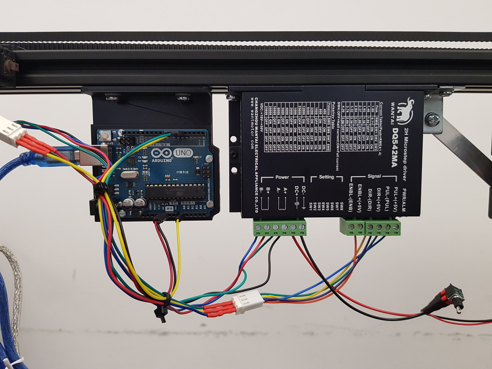
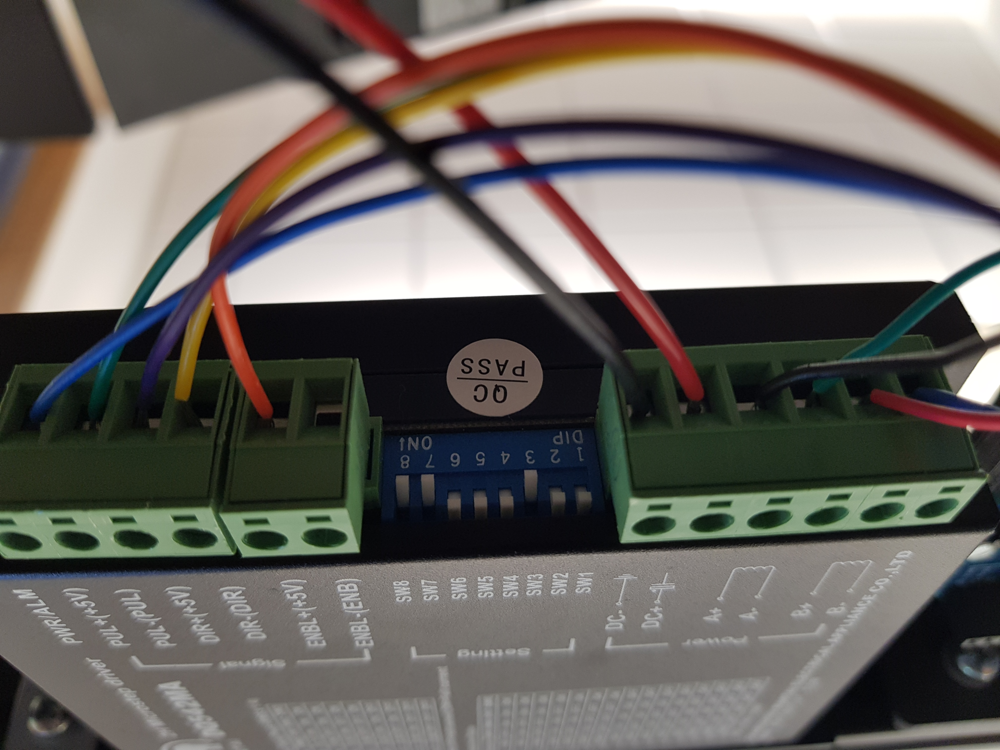

# HDR Light Field Capture
Hardware and software for capturing Hight Dynamic Range light fields.


The setup consists of an Arduino used to control the Stepper Motor and a Raspberry Pi used to send instructions to the Arduino and capture/receive images from the camera.

## Arduino

### Wiring



The Stepper Driver used in this setup is DQ542MA and the Stepper Motor used is NEMA 17 42BYGH-W811.

Connection between Stepper Driver and Arduino:
* PUL+ from Driver to Arduino PIN7
* PUL- from Driver to Arduino PIN5
* DIR+ from Driver to Arduino PIN7
* DIR- from Driver to Arduino PIN6
* ENBL+ from Driver to Arduino PIN7

Connection between Stepper Driver and Stepper Motor:
* A+ from Driver to Stepper BLACK wire
* A- from Driver to Stepper GREEN wire
* B+ from Driver to Stepper RED wire
* B- from Driver to Stepper BLUE wire

Connection between Button and Arduino:
* Button YELLOW wire to Arduino PINA0

### DIP Switch Setting



The first three bits of the DIP switch are used to set the dynamic current. For an output current of 2.37A, SW 1, 2, 3 is set to OFF, OFF, ON.

Micro step resolution is set by the last four bits of the DIP switch. For 1600 pulse per revolution, SW 5, 6, 7, 8 is set to OFF, OFF, ON, ON.

### Power Supply


The power supply for the Stepper Driver is 18V (3 parallel sets of 2 9V batteries in series).

## Python
### Dependencies

Installing libgphoto2:

```sh
sudo apt-get install libgphoto2-dev
```

Installing python-gphoto2 and pySerial for python3 with pip:

```sh
sudo pip3 install gphoto2
sudo pip3 install pyserial
```

### Usage Examples

Specify the port and baud rate for the serial communication between Arduino and Raspberry Pi in `python/camera.py`:

```python
port = '/dev/ttyACM0'
baud_rate = 9600
```

Set the parameters for HDR Light Field capture in `python/control.py`:

```python
# parameters for hdr light field capture
N_LOCATIONS = 11
N_EXPOSURES = 3

camera_name = 'SonyA7r1'
capture_path = '/home/pi/Pictures/capture'
# hdr_merging = False
```

(Optional) Merge the captured images into HDR light field (requires OpenCV):

```python
from merge import merge_light_field

merge_light_field(capture_path, camera_name, N_EXPOSURES)
```

## GUI


GUI allows for basic motor and camera control:
* Motor speed can be set from 1 to 10. 
* Camera location can range from 0 to 100.
* Click `Reset` to reset the speed and location of the motor.
* Click `Capture` to capture a single image.
* Click `Capture 3D` to capture hdr light field.

## Release History

* 0.1.0
    * The first proper release
    * CHANGE: Add `arduino` and `python`
* 0.0.1
    * Work in progress
